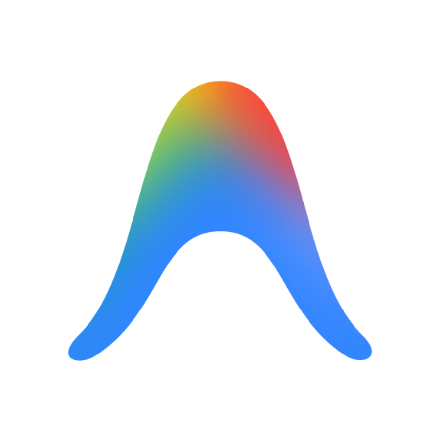
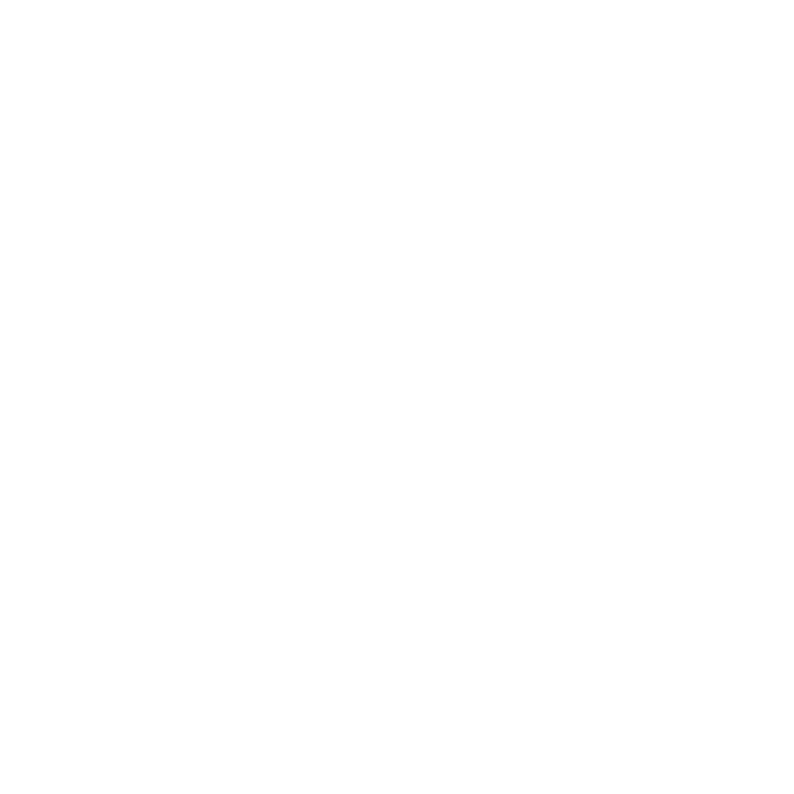
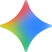
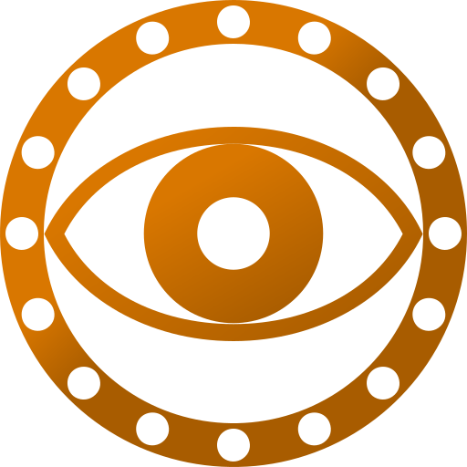
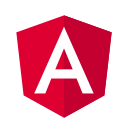
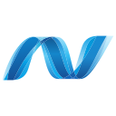
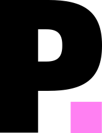
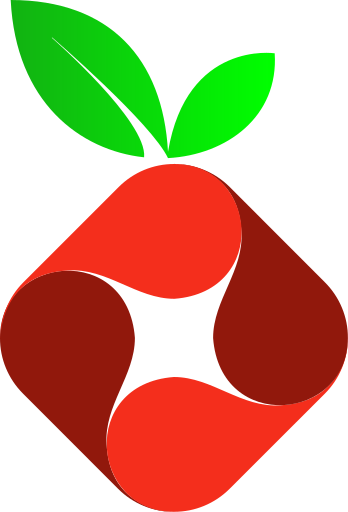
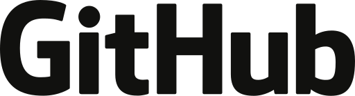
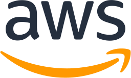

# ⚡ ICONS-ASSETS

<p align="center">
  
</p>

<p align="center">
  <strong>The Ultimate Multi-Category Icon, Logo & Badge Repository</strong><br/>
  Over <strong>350,000+</strong> authentic, curated vector SVGs and high-resolution raster assets across 8 distinct domains.
</p>

<p align="center">
  
  
  
  
</p>

---

## 📑 Table of Contents
- [✨ Key Features](#-key-features)
- [📦 Installation & Terminal CLI](#-installation--terminal-cli)
- [🚀 Publishing to NPM (Owner Guide)](#-publishing-to-npm-owner-guide)
- [🖼️ Visual Showcase & Catalog Navigation](#️-visual-showcase--catalog-navigation)
  - [1. 🤖 AI Models & Coding Agents](#1--ai-models--coding-agents)
  - [2. 💻 Programming Languages & Frameworks](#2--programming-languages--frameworks)
  - [3. 📊 Self-Hosted & Dashboard Applications](#3--self-hosted--dashboard-applications)
  - [4. 🏢 Global Tech Brands & Platforms](#4--global-tech-brands--platforms)
  - [5. ☁️ Cloud Architecture Vectors](#5-️-cloud-architecture-vectors)
  - [6. 🖥️ OS & Desktop Environments](#6-️-os--desktop-environments)
  - [7. 🎨 System & Product UI Icons](#7--system--product-ui-icons)
  - [8. 📱 Mobile & Cross-Platform Icons](#8--mobile--cross-platform-icons)
  - [9. 👾 Pixel Art & Retro UI](#9--pixel-art--retro-ui)
- [💻 Programmatic JavaScript/TypeScript Usage](#-programmatic-javascripttypescript-usage)
- [📂 Complete Directory Map](#-complete-directory-map)

---

## ✨ Key Features
- **350,000+ Total Assets**: 299,000+ pure vector SVGs, 51,000+ high-res PNGs, WebPs, and macOS `.icns` files.
- **Zero Build Bloat**: All intermediate source code, build scripts, tests, and temporary files have been permanently stripped. Only pure image assets and metadata remain.
- **Modular Terminal CLI**: Extract only the specific icons you need (`apple`, `google`, `microsoft`, `languages`, `ai`) without downloading gigabytes of assets into your project.
- **Node.js Subpath Exports**: First-class support for `import "@greninja-op/icons-assets/<category>"` in Vite, Next.js, and Webpack.
- **Unified Categorization**: Clean directory layout partitioned by industry standards (Brands, Cloud, DevTools, OS, UI, Pixel, Mobile).

---

## 📦 Installation & Terminal CLI

You can consume `@greninja-op/icons-assets` as a standard dependency or extract individual categories on-demand using `npx`.

### 1. Selective Download via CLI (Recommended)
Download only the specific category or brand family you need directly into your project:

```bash
# List all categories and asset counts
npx @greninja-op/icons-assets list

# Search for any icon by keyword
npx @greninja-op/icons-assets search antigravity

# Extract Apple & macOS application icons into ./src/assets/apple
npx @greninja-op/icons-assets get apple ./src/assets/apple

# Extract Google Cloud & Workspace icons into ./src/assets/google
npx @greninja-op/icons-assets get google ./src/assets/google

# Extract Microsoft 365 & Cloud logos into ./src/assets/microsoft
npx @greninja-op/icons-assets get microsoft ./src/assets/microsoft

# Extract Programming Languages & Tech Stacks into ./src/assets/languages
npx @greninja-op/icons-assets get languages ./src/assets/languages

# Extract AI Models & Coding Agents (Claude, ChatGPT, Antigravity, Gemini)
npx @greninja-op/icons-assets get ai ./src/assets/ai

# Extract Cloud Architecture (AWS, CNCF, GCP)
npx @greninja-op/icons-assets get cloud ./src/assets/cloud
```

### 2. Full NPM Package Installation
For projects requiring offline access or bundling across multiple categories:

```bash
npm install @greninja-op/icons-assets
```

---

## 🚀 Publishing to NPM (Owner Guide)

As the owner of the `greninja-op` account, follow these steps to publish `@greninja-op/icons-assets` to the NPM registry:

### Step 1: Log in to your NPM Account
In your terminal, authenticate with NPM:
```bash
npm login
```
*Enter your NPM username, password, and one-time two-factor authentication (2FA) code.*

### Step 2: Verify Authentication
```bash
npm whoami
# Should output: your-npm-username
```

### Step 3: Publish with Public Access
Because scoped packages (`@scope/package-name`) default to private on NPM, publish with the `--access public` flag:
```bash
cd ICONS-ASSETS
npm publish --access public
```

### Step 4: Updating the Package in the Future
Whenever you update icons or add new suites:
```bash
# Bump the version (patch: 1.0.1, minor: 1.1.0, major: 2.0.0)
npm version patch

# Publish the new release
npm publish --access public
```

---

## 🖼️ Visual Showcase & Catalog Navigation

Click on any category name or directory path to browse that specific folder directly.

### 1. 🤖 AI Models & Coding Agents
Official vector icons for modern foundation models, LLMs, and agentic coding environments.

📁 **Directory**: [`brands-and-logos/ai-agents/`](./brands-and-logos/ai-agents/)

| Preview | Model / Tool | Format | Directory Link |
| :---: | :--- | :---: | :--- |
|  | **Antigravity IDE** | SVG | [`brands-and-logos/ai-agents/antigravity.svg`](./brands-and-logos/ai-agents/antigravity.svg) |
|  | **Anthropic Claude** | SVG | [`brands-and-logos/ai-agents/claude.svg`](./brands-and-logos/ai-agents/claude.svg) |
|  | **ChatGPT / OpenAI** | SVG | [`brands-and-logos/ai-agents/chatgpt.svg`](./brands-and-logos/ai-agents/chatgpt.svg) |
|  | **Google Gemini** | SVG | [`brands-and-logos/ai-agents/gemini.svg`](./brands-and-logos/ai-agents/gemini.svg) |
|  | **DeepSeek** | SVG | [`brands-and-logos/ai-agents/deepseek.svg`](./brands-and-logos/ai-agents/deepseek.svg) |
|  | **Cursor IDE** | SVG | [`brands-and-logos/ai-agents/cursor.svg`](./brands-and-logos/ai-agents/cursor.svg) |
|  | **OpenAI Codex** | SVG | [`brands-and-logos/ai-agents/codex.svg`](./brands-and-logos/ai-agents/codex.svg) |
|  | **Ollama** | SVG | [`brands-and-logos/ai-agents/ollama.svg`](./brands-and-logos/ai-agents/ollama.svg) |
|  | **xAI Grok** | SVG | [`brands-and-logos/ai-agents/grok.svg`](./brands-and-logos/ai-agents/grok.svg) |

---

### 2. 💻 Programming Languages & Frameworks
425+ high-fidelity vector logos for programming languages, UI frameworks, runtimes, and databases.

📁 **Directory**: [`developer-tools/stacks-and-languages/`](./developer-tools/stacks-and-languages/)

| Preview | Language / Stack | Format | Directory Link |
| :---: | :--- | :---: | :--- |
|  | **Python** | SVG | [`developer-tools/stacks-and-languages/Python.svg`](./developer-tools/stacks-and-languages/Python.svg) |
|  | **Rust** | SVG | [`developer-tools/stacks-and-languages/Rust.svg`](./developer-tools/stacks-and-languages/Rust.svg) |
|  | **JavaScript** | SVG | [`developer-tools/stacks-and-languages/JavaScript.svg`](./developer-tools/stacks-and-languages/JavaScript.svg) |
|  | **TypeScript** | SVG | [`developer-tools/stacks-and-languages/TypeScript.svg`](./developer-tools/stacks-and-languages/TypeScript.svg) |
|  | **Go (Golang)** | SVG | [`developer-tools/stacks-and-languages/Go.svg`](./developer-tools/stacks-and-languages/Go.svg) |
|  | **React** | SVG | [`developer-tools/stacks-and-languages/React.svg`](./developer-tools/stacks-and-languages/React.svg) |
|  | **Vue.js** | SVG | [`developer-tools/stacks-and-languages/Vue.js.svg`](./developer-tools/stacks-and-languages/Vue.js.svg) |
|  | **Angular** | SVG | [`developer-tools/stacks-and-languages/Angular.svg`](./developer-tools/stacks-and-languages/Angular.svg) |
|  | **Docker** | SVG | [`developer-tools/stacks-and-languages/Docker.svg`](./developer-tools/stacks-and-languages/Docker.svg) |
|  | **Kubernetes** | SVG | [`developer-tools/stacks-and-languages/Kubernetes.svg`](./developer-tools/stacks-and-languages/Kubernetes.svg) |
|  | **.NET / C#** | SVG | [`developer-tools/stacks-and-languages/.NET.svg`](./developer-tools/stacks-and-languages/.NET.svg) |
|  | **CSS3** | SVG | [`developer-tools/stacks-and-languages/CSS3.svg`](./developer-tools/stacks-and-languages/CSS3.svg) |

---

### 3. 📊 Self-Hosted & Dashboard Applications
11,700+ authentic vector and raster icons specifically designed for home dashboards (Homarr, Homepage, Dashy, Flame) and self-hosted server services.

📁 **Directory**: [`apps-and-dashboards/`](./apps-and-dashboards/)

| Preview | Application | Format | Directory Link |
| :---: | :--- | :---: | :--- |
|  | **Home Assistant** | SVG / PNG / WebP | [`apps-and-dashboards/svg/home-assistant.svg`](./apps-and-dashboards/svg/home-assistant.svg) |
|  | **Plex Media Server** | SVG / PNG / WebP | [`apps-and-dashboards/svg/plex.svg`](./apps-and-dashboards/svg/plex.svg) |
|  | **Grafana** | SVG / PNG / WebP | [`apps-and-dashboards/svg/grafana.svg`](./apps-and-dashboards/svg/grafana.svg) |
|  | **Nextcloud** | SVG / PNG / WebP | [`apps-and-dashboards/svg/nextcloud.svg`](./apps-and-dashboards/svg/nextcloud.svg) |
|  | **Portainer** | SVG / PNG / WebP | [`apps-and-dashboards/svg/portainer.svg`](./apps-and-dashboards/svg/portainer.svg) |
|  | **Jellyfin** | SVG / PNG / WebP | [`apps-and-dashboards/svg/jellyfin.svg`](./apps-and-dashboards/svg/jellyfin.svg) |
|  | **Pi-hole** | SVG / PNG / WebP | [`apps-and-dashboards/svg/pi-hole.svg`](./apps-and-dashboards/svg/pi-hole.svg) |

---

### 4. 🏢 Global Tech Brands & Platforms
26,000+ vector brand logos from SimpleIcons and Gilbarbara Vector Logos.

📁 **Directory**: [`brands-and-logos/`](./brands-and-logos/)

| Preview | Brand / Service | Format | Directory Link |
| :---: | :--- | :---: | :--- |
|  | **Apple** | SVG | [`brands-and-logos/gilbarbara-logos/logos/apple.svg`](./brands-and-logos/gilbarbara-logos/logos/apple.svg) |
|  | **Google** | SVG | [`brands-and-logos/gilbarbara-logos/logos/google.svg`](./brands-and-logos/gilbarbara-logos/logos/google.svg) |
|  | **Microsoft** | SVG | [`brands-and-logos/gilbarbara-logos/logos/microsoft.svg`](./brands-and-logos/gilbarbara-logos/logos/microsoft.svg) |
|  | **GitHub** | SVG | [`brands-and-logos/gilbarbara-logos/logos/github.svg`](./brands-and-logos/gilbarbara-logos/logos/github.svg) |
|  | **AWS (Amazon Web Services)** | SVG | [`brands-and-logos/gilbarbara-logos/logos/aws.svg`](./brands-and-logos/gilbarbara-logos/logos/aws.svg) |
|  | **Discord** | SVG | [`brands-and-logos/gilbarbara-logos/logos/discord.svg`](./brands-and-logos/gilbarbara-logos/logos/discord.svg) |
|  | **Spotify** | SVG | [`brands-and-logos/gilbarbara-logos/logos/spotify.svg`](./brands-and-logos/gilbarbara-logos/logos/spotify.svg) |
|  | **YouTube** | SVG | [`brands-and-logos/gilbarbara-logos/logos/youtube.svg`](./brands-and-logos/gilbarbara-logos/logos/youtube.svg) |

---

### 5. ☁️ Cloud Architecture Vectors
Official architecture diagrams and service icons for AWS, Google Cloud (GCP), Microsoft Azure, and CNCF Cloud Native landscape.

📁 **Directory**: [`cloud-architecture/`](./cloud-architecture/)

| Suite | Provider / Ecosystem | Asset Count | Directory Link |
| :--- | :--- | :---: | :--- |
| **AWS Architecture Icons** | Amazon Web Services official service SVGs | ~4,200 | [`cloud-architecture/aws-icons-svg/`](./cloud-architecture/aws-icons-svg/) |
| **CNCF Artwork** | Kubernetes, Prometheus, Envoy, Helm, OpenTelemetry | ~3,800 | [`cloud-architecture/cncf-artwork/`](./cloud-architecture/cncf-artwork/) |
| **Google Cloud Icons** | Compute Engine, BigQuery, Cloud Run, GKE | ~220 | [`cloud-architecture/google-cloud-icons/`](./cloud-architecture/google-cloud-icons/) |
| **Microsoft Cloud Logos** | Azure services, Microsoft 365, Power Platform | ~2,130 | [`brands-and-logos/microsoft-cloud-logos/`](./brands-and-logos/microsoft-cloud-logos/) |

---

### 6. 🖥️ OS & Desktop Environments
Over 213,000 desktop icons, system app glyphs, and window manager assets across macOS, Ubuntu, KDE, and Linux.

📁 **Directory**: [`os-and-desktop/`](./os-and-desktop/)

| Suite | Operating System / DE | Asset Count | Directory Link |
| :--- | :--- | :---: | :--- |
| **macOS Icons** | Apple macOS Sonoma / Big Sur Application ICNS & PNGs | ~620 | [`os-and-desktop/macos-icons/`](./os-and-desktop/macos-icons/) |
| **Ubuntu Yaru** | Official Ubuntu default GTK & GNOME theme | ~3,600 | [`os-and-desktop/ubuntu-yaru/`](./os-and-desktop/ubuntu-yaru/) |
| **Papirus Icon Theme** | Flagship Linux desktop theme covering thousands of apps | ~120,000 | [`os-and-desktop/papirus-icon-theme/`](./os-and-desktop/papirus-icon-theme/) |
| **WhiteSur Icon Theme** | macOS Big Sur-styled vector icons for desktop applications | ~45,000 | [`os-and-desktop/whitesur-icon-theme/`](./os-and-desktop/whitesur-icon-theme/) |
| **Breeze Icons** | Official KDE Plasma desktop icon set | ~18,000 | [`os-and-desktop/breeze-icons/`](./os-and-desktop/breeze-icons/) |
| **Elementary Icons** | elementary OS crisp desktop icon suite | ~8,000 | [`os-and-desktop/elementary-icons/`](./os-and-desktop/elementary-icons/) |

---

### 7. 🎨 System & Product UI Icons
Over 76,000 UI icons for design systems, web dashboards, buttons, and navigation bars.

📁 **Directory**: [`system-and-ui/`](./system-and-ui/)

| Suite | Design System / Creator | Features | Directory Link |
| :--- | :--- | :---: | :--- |
| **Microsoft Fluent UI** | Microsoft Windows 11 & Office Design System | 21,700+ SVGs | [`system-and-ui/fluentui-system-icons/`](./system-and-ui/fluentui-system-icons/) |
| **Google Material Design** | Material Symbols & Google Design Icons | 10,000+ SVGs | [`system-and-ui/material-design-icons/`](./system-and-ui/material-design-icons/) |
| **Apple SF Symbols** | iOS & macOS San Francisco vector symbols | 5,000+ SVGs | [`system-and-ui/sfsymbols-svg/`](./system-and-ui/sfsymbols-svg/) |
| **Lucide Icons** | Crisp, consistent community-forked vector icons | 1,400+ SVGs | [`system-and-ui/lucide/`](./system-and-ui/lucide/) |
| **Tabler Icons** | Highly customizable stroke-based UI icons | 5,200+ SVGs | [`system-and-ui/tabler-icons/`](./system-and-ui/tabler-icons/) |
| **Phosphor Icons** | Flexible icon family in 6 weights (thin to fill) | 9,000+ SVGs | [`system-and-ui/phosphor-icons/`](./system-and-ui/phosphor-icons/) |
| **RemixIcon** | Open-source neutral-style system symbols | 2,800+ SVGs | [`system-and-ui/remixicon/`](./system-and-ui/remixicon/) |
| **ByteDance IconPark** | Enterprise UI icon collection from ByteDance | 2,600+ SVGs | [`system-and-ui/iconpark/`](./system-and-ui/iconpark/) |

---

### 8. 📱 Mobile & Cross-Platform Icons
Framework-optimized icons for React Native, Flutter, Ionic, and mobile web views.

📁 **Directory**: [`mobile-and-app/`](./mobile-and-app/)

| Suite | Optimized For | Asset Count | Directory Link |
| :--- | :--- | :---: | :--- |
| **Ionicons** | iOS & Android hybrid mobile apps | ~1,300 | [`mobile-and-app/ionicons/`](./mobile-and-app/ionicons/) |
| **CoreUI Icons** | Mobile administration dashboards | ~1,600 | [`mobile-and-app/coreui-icons/`](./mobile-and-app/coreui-icons/) |
| **Bytesize Icons** | Ultra-lightweight micro-footprint SVGs | ~100 | [`mobile-and-app/bytesize-icons/`](./mobile-and-app/bytesize-icons/) |

---

### 9. 👾 Pixel Art & Retro UI
Authentic 8-bit, 16-bit, and grid-aligned pixel assets for gaming and retro designs.

📁 **Directory**: [`pixel-art/`](./pixel-art/)

| Suite | Style | Asset Count | Directory Link |
| :--- | :--- | :---: | :--- |
| **HackerNoon Pixel Icons** | Retro cyber/tech 24px pixel iconography | ~4,800 | [`pixel-art/hackernoon-pixel/`](./pixel-art/hackernoon-pixel/) |
| **Pixelarticons** | Crisp 24x24 monochrome pixel art SVGs | ~1,400 | [`pixel-art/pixelarticons/`](./pixel-art/pixelarticons/) |

---

## 💻 Programmatic JavaScript/TypeScript Usage

```javascript
const { findIcon, getCategoryPath, CATEGORIES } = require('@greninja-op/icons-assets');

// 1. Get path to specific category folder
const appleFolder = getCategoryPath('apple');
console.log('Apple assets located at:', appleFolder);

// 2. Find any icon by name across the entire library
const antigravityPath = findIcon('antigravity.svg');
console.log('Antigravity SVG:', antigravityPath);

// 3. Find icon within a specific category
const pythonPath = findIcon('Python.svg', 'languages');
console.log('Python SVG:', pythonPath);
```

---

## 📂 Complete Directory Map

```text
ICONS-ASSETS/
├── apps-and-dashboards/          # 11,700+ Homarr, Plex, Home Assistant, Grafana icons
│   ├── svg/                      # 3,431 Pure SVGs
│   ├── png/                      # 4,158 High-res PNGs
│   ├── webp/                     # 4,148 WebPs
│   └── metadata.json             # Search index & official URL mapping
├── brands-and-logos/             # 26,000+ Brand & platform logos
│   ├── ai-agents/                # 17 Official AI model logos (Antigravity, Claude, ChatGPT, Gemini)
│   ├── simple-icons/             # 3,100+ Monochromatic brand SVGs
│   ├── gilbarbara-logos/         # 800+ Multi-color vector brand logos
│   ├── microsoft-cloud-logos/    # 2,130 Azure & M365 logos
│   ├── browser-logos/            # Chrome, Firefox, Safari, Edge, Brave
│   ├── supertinyicons/           # Minified ultra-small SVGs
│   └── hd-icons/                 # High-resolution raster and vector brands
├── cloud-architecture/           # 8,200+ Architecture diagram icons
│   ├── aws-icons-svg/            # Official AWS service icons
│   ├── cncf-artwork/             # Kubernetes, Envoy, Prometheus, Helm
│   └── google-cloud-icons/       # Google Cloud Platform service SVGs
├── developer-tools/              # 5,200+ Developer ecosystem assets
│   ├── stacks-and-languages/     # 425+ Languages & Frameworks (.NET, Python, Rust, React, Docker)
│   ├── devicon/                  # Programming languages, fonts & frameworks
│   ├── vscode-material-icon-theme/# VS Code file & folder icons
│   ├── vscode-icons/             # Classic VS Code icon pack
│   ├── octicons/                 # GitHub official Octicon SVGs
│   └── skill-icons/              # Readme badges & stack pills
├── mobile-and-app/               # 3,000+ Mobile UI icons
│   ├── ionicons/                 # Ionic mobile icons
│   ├── coreui-icons/             # CoreUI admin suite
│   └── bytesize-icons/           # Micro SVGs
├── os-and-desktop/               # 213,000+ Desktop & OS icons
│   ├── macos-icons/              # Apple macOS Sonoma / Big Sur app icons & ICNS
│   ├── ubuntu-yaru/              # Official Ubuntu Linux GTK theme
│   ├── papirus-icon-theme/       # Premier Linux desktop theme
│   ├── whitesur-icon-theme/      # Big Sur-styled vector desktop icons
│   ├── breeze-icons/             # KDE Plasma desktop theme
│   ├── elementary-icons/         # elementary OS icons
│   └── adwaita-icon-theme/       # GNOME desktop icons
├── pixel-art/                    # 6,200+ Pixel art & 8-bit icons
│   ├── hackernoon-pixel/         # HackerNoon pixel icons
│   └── pixelarticons/            # 24x24 pixel vector SVGs
├── system-and-ui/                # 76,000+ UI & Design System icons
│   ├── fluentui-system-icons/    # Microsoft Fluent UI 21,700+ SVGs
│   ├── material-design-icons/    # Google Material Symbols
│   ├── sfsymbols-svg/            # Apple SF Symbols
│   ├── lucide/                   # Lucide vector icons
│   ├── tabler-icons/             # Tabler vector icons
│   ├── phosphor-icons/           # Phosphor multi-weight icons
│   ├── remixicon/                # Remix neutral system icons
│   └── iconpark/                 # ByteDance IconPark
├── bin/                          # Interactive CLI executable
│   └── cli.js                    # npx @greninja-op/icons-assets engine
├── index.js                      # Programmatic CommonJS API
└── package.json                  # NPM configuration & subpath exports
```

---

<p align="center">
  Maintained by <a href="https://github.com/greninja-op"><strong>@greninja-op</strong></a> • Built for developers, designers, and creators worldwide.
</p>
